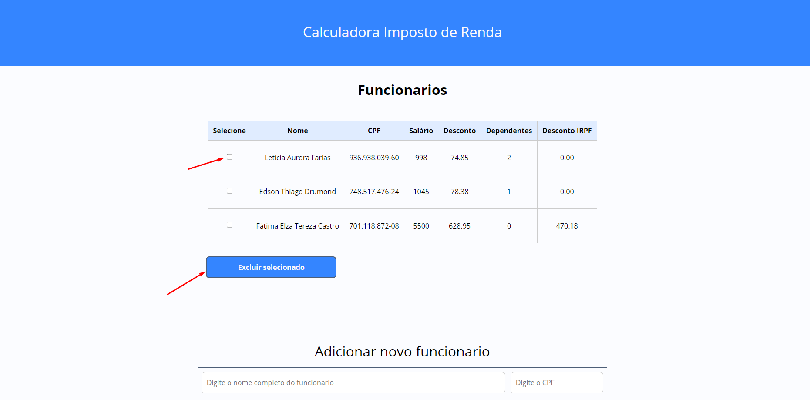

# SDR-calculadoraIRPF

## Descrição do Projeto

 Aplicação web que permite gerenciar funcionários e o cálculo de imposto de renda retido da fonte(IRRF) de cada um deles. 

  

### Baixando e executando projeto

- Clone o projeto a partir do Github
  - [Clique_Aqui](https://docs.github.com/pt/github/creating-cloning-and-archiving-repositories/cloning-a-repository-from-github/cloning-a-repository) para saber como clonar.
- Abra o arquivo index.html no seu navegador
- Para adcionar um novo funcionario você deve indicar os dados: nome, cpf, salario, desconto previdencia e quantidade de dependentes. Em seguida clicar no botão adicionar.
  - Caso deixe algum campo em branco, apresentará uma mensagem de campo obrigatório.
- Para exclusão de um cadastro, deve selecionar no checkbox  que corresponde ao cadastro, na coluna selecione. E em seguida clicar em Excluir selecionado.

  

### Features

- [x] Cadastro de funcionario
- [x] Excluir funcionario
- [x] Calculo do desconto IRPF
- [x] Listar funcionários cadastrados
- [ ] Atualizar cadastro de funcionario

